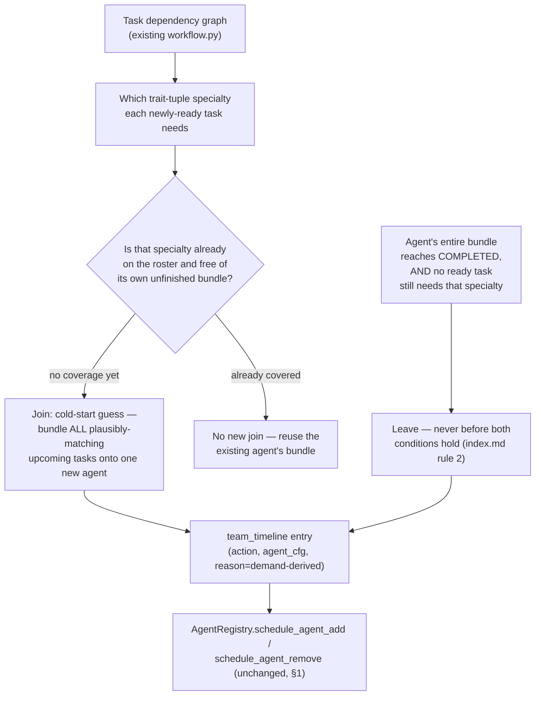

# Autoscaling-Driven Team Non-Stationarity (Draft Proposal)

**Status: draft discussion doc — nothing implemented, no code changed.** Companion to
`benchmark_conversion.md`'s "What MA-Gym already gives us for free" section
("non-stationarity... via autoscaling or agent failure") and its "The generic 6-step procedure"
step 6 (team-timeline adjustment), plus `open_aht_benchmark_plan_prev.md` §3.1 (trait tuple /
interchangeable replicas, not yet split into its own `trait_tuple.md`). Written to picture the
mechanism before deciding whether to build it — see open questions at the end.

## Why reconsider the current mechanism

`legal_m_and_a/team.py::create_team_timeline()` — like every scenario's team timeline today —
is a hand-authored dict of `(timestep, agent, narrative reason)` triples: *"diligence_reader
removed at t=12 — front-loaded triage complete."* The plan already frames non-stationarity as
coming from "autoscaling or agent failure" (§1 definitions), but nothing in the actual
mechanism scales anything — it's a fixed script that merely gestures at that framing after the
fact.

That's a gap worth closing on its own terms, not just for realism: if the benchmark's claim is
"can the manager adapt to a changing team," the change itself should have a legible, in-principle-
reasonable-about cause — not an arbitrary authored event the manager has no way to anticipate or
make sense of.

**Correction (supersedes the original "load vs. capacity" framing below the mermaid diagram):**
this was originally modeled on ASG/HPA-style autoscaling — a pool's replica count tracking a load
signal. That framing doesn't hold up against how the engine actually executes tasks: there is no
per-agent concurrency limit anywhere in `manager_agent_gym/core/execution/engine.py` — the
ready-task loop starts *every* ready task that has an `assigned_agent_id` via
`asyncio.create_task(agent.execute_task(...))`, with no check for whether that same agent is
already mid-execution on something else. One agent instance can already run an unbounded number
of tasks concurrently, so "add a replica because load exceeds capacity" was describing a queueing
constraint the engine never enforces. What actually needs deriving from the task graph is simpler
and more honest about what's being tested: **which specialty is needed**, not **how many units of
it exist**. The mechanism below is the corrected version.

## Proposed mechanism — generic, ignoring any specific benchmark

Core idea: team churn is *derived* from which specialty the task graph currently needs, rather
than *authored* one event at a time and rather than tracked against a capacity threshold.
Critically, this still outputs the same `{timestep: [(action, agent_cfg, reason), ...]}` shape
`create_team_timeline()` already produces — §1's "already plumbed end-to-end, reuse unchanged"
claim holds; only *how the dict's contents get decided* changes.

There is deliberately no "scale-in because load dropped while work is still running" path and no
"replace this agent because it left mid-bundle" path — removal is gated strictly on the bundle
being finished (rule 2 in `index.md`), and a join is a one-shot cold-start bet covering a whole
bundle, never revisited by handing part of that bundle to a different agent (rule 1). Failure
injection (an agent disappearing for a reason *other* than finishing its work) is explicitly not
modeled here — see `index.md`'s "Explicitly out of scope."

Two ways to derive the *timing* — **resolved in favor of offline**, not an open choice:

- **Offline (static) — the decided method.** Compute the whole schedule once at
  scenario-authoring time from the task graph's *dependency structure*, and bake it into a fixed
  `team_timeline` dict — same engine interface as today, zero engine changes. This is what
  "externally triggered" actually requires: the schedule must be independent of the manager's
  own decisions to count as exogenous non-stationarity at all, and it's precomputed *because* it
  has to be — a benchmark with no real external demand signal to hook into simulates one by
  fixing it in advance from the graph's shape, not from what a specific run's manager happens to
  do.
- **Runtime (dynamic) — rejected, not "more faithful."** Deriving readiness/completion from the
  *live* run sounds closer to reality, but isn't: task readiness and completion timing are
  themselves downstream of the manager's own assignment and execution choices, so a live signal
  is **manager-reactive**, not externally imposed — an agent's bundle finishing sooner because the
  manager assigned well is not exogenous churn, it's a side-effect of the manager's own
  performance. That disqualifies it as a test of adaptation to non-stationarity outside the
  manager's control, which is the entire point. See `benchmark_conversion.md`'s "Team-churn
  generation" section for the full reasoning.

## Applied to `legal_m_and_a` — see the actual built scenario, not this section

This section originally carried an illustrative, pre-implementation pool/gantt sketch based on
"load windows." That sketch is now superseded and removed — `legal_m_and_a` has since been
actually built under the demand-driven model above, and the built version is the authoritative
account, not a proposal. Read:

- [`examples/end_to_end_examples_aht/legal_m_and_a/team.py`](../../examples/end_to_end_examples_aht/legal_m_and_a/team.py) —
  the real `create_team_timeline()`, with join/leave reasons stated as "specialty needed by task
  X" / "bundle complete, nothing ready needs this specialty," never as a capacity threshold.
- [`examples/end_to_end_examples_aht/legal_m_and_a/AHT_DIFF.md`](../../examples/end_to_end_examples_aht/legal_m_and_a/AHT_DIFF.md) —
  the causal chain (task-graph event → roster response) for the actual built timeline.
- [`examples/end_to_end_examples_aht/legal_m_and_a/MANAGER_WALKTHROUGH.md`](../../examples/end_to_end_examples_aht/legal_m_and_a/MANAGER_WALKTHROUGH.md) —
  a manually-reasoned dry run of manager decisions against that timeline, timestep by timestep,
  including where the design still has open issues.

## Open questions — decide before any code follows

- ~~Offline vs. runtime derivation~~ — **resolved, see above**: offline is the decided method,
  not a placeholder pending a choice.
- ~~Load vs. capacity as the churn signal~~ — **resolved, see "Why reconsider the current
  mechanism" above**: there's no engine-enforced capacity to threshold against, so churn is
  keyed to specialty need, not load.
- **Does a named persona still matter**, or does `requirements` authoring key off pool/
  trait-tuple membership only, with individual agent identity becoming incidental? This changes
  how checklists get written in `benchmark_conversion.md` step 4.
