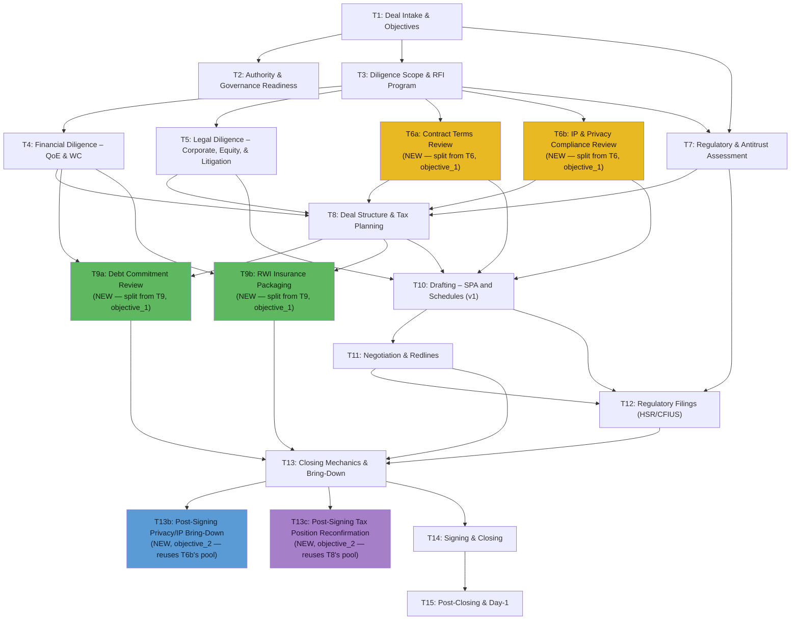
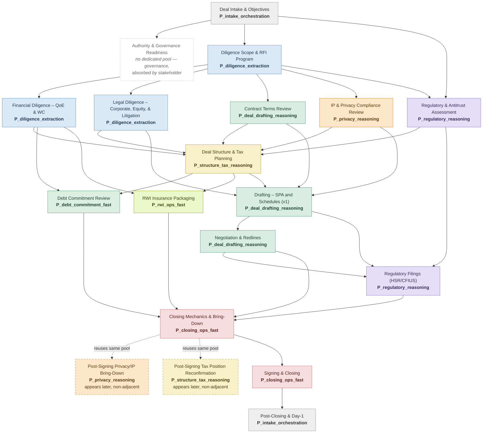
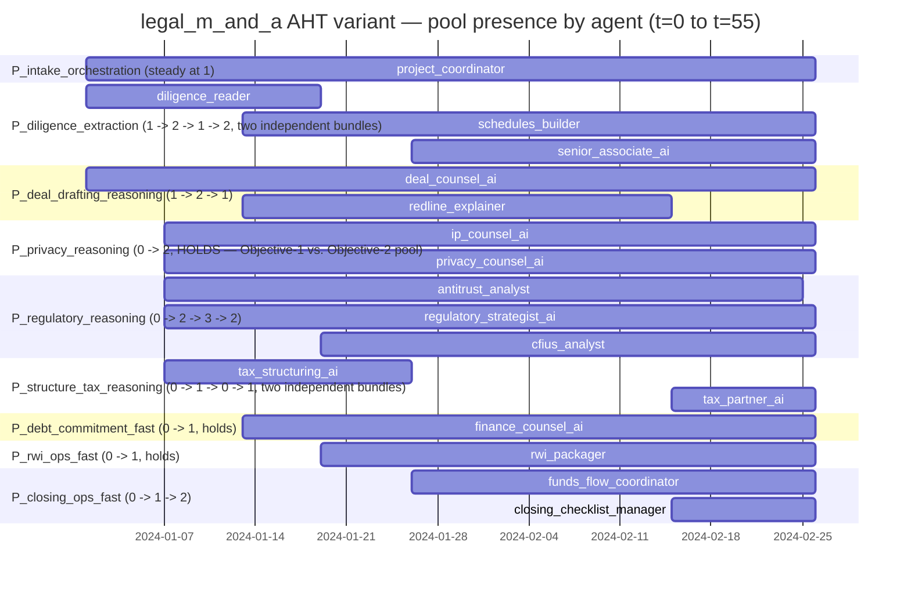

# legal_m_and_a — Original vs. AHT Variant Diff

Compares `examples/end_to_end_examples/legal_m_and_a/` (original) against
`examples/end_to_end_examples_aht/legal_m_and_a/` (AHT variant), built per
`docs/benchmark_aht/benchmark_conversion.md`. Verified by construction (import + instantiate;
no simulation run). Full structured record:
`examples/end_to_end_examples_aht/legal_m_and_a/conversion_spec.yaml`.

## 1. Task graph diff

15 tasks → 19 tasks. **Revision: expanded from 2 to 4 graded checkpoints per episode** (one
Objective-1/2 pair was too little signal per run — see `docs/benchmark_aht/index.md`'s checkpoint
heuristic). T6 and T9 are each replaced by two subtasks (Objective 1 x2); two new tasks, T13b and
T13c, are added after T13 (Objective 2 x2). Every other task is content-identical, only re-IDed
into a new UUID range so both modules can coexist.

| Original | AHT variant | Change |
|---|---|---|
| T6 "Legal Diligence – Material Contracts, IP, & Privacy" | T6a "Contract Terms Review" + T6b "IP & Privacy Compliance Review" | **Split.** Disjoint `requirements`, disjoint pool (Objective 1, checkpoint 1) |
| T9 "Financing Workstream (Debt/RWI)" | T9a "Debt Commitment Review" + T9b "RWI Insurance Packaging" | **Split.** Disjoint `requirements`, disjoint pool (Objective 1, checkpoint 2) — also resolves the single-assignee/two-specialty ambiguity `MANAGER_WALKTHROUGH.md` §3.4 flagged as unresolved |
| — | T13b "Post-Signing Privacy/IP Bring-Down" | **Added.** After T13; reuses T6b's pool (Objective 2, checkpoint 3) |
| — | T13c "Post-Signing Tax Position Reconfirmation" | **Added.** After T13; reuses T8's pool (Objective 2, checkpoint 4) — formalizes the T8→T13 pattern previously noted only as an unformalized "bonus pattern" |
| T1–T5, T7, T8, T10–T12, T13, T14, T15 | same | **Unchanged** content — only `id` changed (new UUID range) |

## 1a. Task → agent-pool assignment (beyond the DAG)

The DAG above shows precedence. It doesn't show *who's staffing each node* — that's the piece
that actually demonstrates autoscaling. Every node below carries its task name **and** the pool
assigned to it, color-coded by pool, same visual language as a standard task→agent assignment
diagram: solid border + color = "this pool owns this task," dashed border = "this task reuses
an existing pool from earlier, at a non-adjacent point in the graph" (the Objective-2 signal).

Four things to read off this diagram directly (one per checkpoint):

- **T6a/T6b sit side by side with different colors** (green vs. orange) despite near-identical
  wording — checkpoint 1, Objective 1.
- **T9a/T9b sit side by side with different colors** (green vs. yellow-green) despite both being
  named for the same original "Financing Workstream" — checkpoint 2, Objective 1. This split also
  resolves the ambiguity `MANAGER_WALKTHROUGH.md` §3.4 found: neither `finance_counsel_ai` nor
  `rwi_packager` alone covered both of the original T9's clauses.
- **T13b is dashed, same orange as T6b** — same pool, drawn far downstream, disconnected from the
  T6a/T6b cluster — checkpoint 3, Objective 2.
- **T13c is dashed, same tan as T8** — same pool, drawn far downstream, disconnected from T8 —
  checkpoint 4, Objective 2, formalizing the previously-unformalized T8→T13 tax pattern.

(T13 is colored by its primary/owning pool for readability; it also receives secondary input from
`P_debt_commitment_fast`/`P_rwi_ops_fast` — see the pool table in §3 for the full feeds-tasks
mapping, which isn't strictly one-pool-per-task.)

## 2. Roster diff — human-role audit (§5.3 step 2)

11 AI + 12 human + 1 stakeholder (24 total) → 17 AI (all converted/original) + 1 stakeholder (18
total). Every `HumanAgentConfig` is gone; each was either converted to an AI equivalent or
dropped.

| Role | Decision | Rationale |
|---|---|---|
| senior_mna_associate | **Convert** → `senior_associate_ai` | Pure knowledge work (drafts, coordinates, runs calls) — no authority language |
| regulatory_counsel | **Convert** → `regulatory_strategist_ai` | Advisory/analysis only, no personal sign-off |
| ip_counsel | **Convert** → `ip_counsel_ai` | Primary verbs validate/draft; central to the T6 split |
| privacy_counsel | **Convert** → `privacy_counsel_ai` | Pure analysis (DPAs, transfers, security); central to the T6 split |
| finance_counsel | **Convert** → `finance_counsel_ai` | Knowledge/coordination work, no personal authority |
| tax_partner | **Convert** → `tax_partner_ai` | Advisory work; deliberately kept same tuple as `tax_structuring_ai` (natural reuse pattern) |
| lead_mna_partner | **Drop** | Core identity is sign-off authority; drafting overlap already covered, authority overlap covered by the stakeholder |
| employment_counsel | **Drop** | Orphan — no task in `workflow.py` ever depended on it |
| rwi_broker | **Drop** | Never scheduled in the original `team_timeline` at all; duplicated by `rwi_packager` (AI) |
| acquirer_gc | **Drop** | Redundant with the existing `acquirer_gc_stakeholder` |
| acquirer_cfo | **Drop** | Approval authority; knowledge-work overlap covered by `finance_counsel_ai`/`funds_flow_coordinator` |
| target_ceo | **Drop** | External (target-side) counterparty, not an acquirer-side worker |

Unchanged (already AI in the original): `deal_counsel_ai`, `diligence_reader`,
`schedules_builder`, `redline_explainer`, `antitrust_analyst`, `cfius_analyst`,
`tax_structuring_ai`, `rwi_packager`, `funds_flow_coordinator`, `closing_checklist_manager`,
`project_coordinator`.

## 3. Pool mapping (§3.3 / §5.3a — new in the AHT variant)

The original had no concept of pools — 24 individually-scripted personas with narrative
join/leave reasons. The AHT variant groups the 17 surviving AI agents into 9 pools (up from 7 —
`P_closing_ops_fast` was split into three so T9's checkpoint has disjoint pools to route to), with
`team_timeline` events reasoned from each pool's task-graph readiness window instead of authored
per-persona.

| Pool | Trait tuple | Members | Feeds |
|---|---|---|---|
| `P_intake_orchestration` | `fast_gpt4o_mini` | project_coordinator | T1, T2, T15 |
| `P_diligence_extraction` | `extraction_gpt4o` | diligence_reader, senior_associate_ai, schedules_builder | T3, T4, T5, T10 |
| `P_deal_drafting_reasoning` | `reasoning_gpt4o` | deal_counsel_ai, redline_explainer | **T6a**, T10, T11 |
| `P_privacy_reasoning` | `privacy_reasoning_gpt4o` **(NEW tuple)** | ip_counsel_ai, privacy_counsel_ai | **T6b, T13b** |
| `P_regulatory_reasoning` | `reasoning_gpt4o` (reused) | antitrust_analyst, cfius_analyst, regulatory_strategist_ai | T7, T12 |
| `P_structure_tax_reasoning` | `reasoning_gpt4o` (reused) | tax_structuring_ai, tax_partner_ai | T8, **T13c** |
| `P_debt_commitment_fast` **(NEW pool)** | `fast_gpt4o_mini` (reused) | finance_counsel_ai | **T9a** |
| `P_rwi_ops_fast` **(NEW pool)** | `fast_gpt4o_mini` (reused) | rwi_packager | **T9b** |
| `P_closing_ops_fast` | `fast_gpt4o_mini` (reused) | funds_flow_coordinator, closing_checklist_manager | T13, T14 |

`privacy_reasoning_gpt4o` is the one addition to the shared `TRAIT_POOL` (for T6a/T6b). T9a/T9b
deliberately do **not** get a new tuple — `P_debt_commitment_fast`/`P_rwi_ops_fast` both reuse
`fast_gpt4o_mini`, same precedent as `P_regulatory_reasoning`/`P_structure_tax_reasoning` sharing
`reasoning_gpt4o` — the discriminating signal is each persona's `system_prompt`, not the tuple
label (already established: `capability_tier` has no execution-level effect on its own).

## 3a. Roster timeline diff — demand-driven, not capacity-driven

**Mechanism change, in one line:** the original scripts 22 named individuals joining/leaving
for narrative reasons ("front-loaded triage complete"); the AHT variant joins/leaves 7 *pools*
for a demand reason ("this specialty is now needed" / "this cold-start bundle is done and
nothing ready still needs it") — same total headcount shape, different generating mechanism,
and **no load/capacity threshold anywhere** (the engine has no per-agent concurrency limit to
threshold against — see `docs/benchmark_aht/autoscaling_team_churn.md`).

**Two binding rules every event below satisfies** (`docs/benchmark_aht/index.md` "Two design
rules"): (1) a join is a one-shot cold-start bundle covering every task that specialty will
plausibly need, never split mid-way onto a different specialist; (2) a `remove` fires only once
every task in that bundle is `COMPLETED` and nothing ready still needs the pool. This revision
fixes two violations present in the previous build: `diligence_reader` no longer hands T4/T5 to
`senior_associate_ai` on departure — it keeps the whole T3+T4+T5 bundle to completion; and
`tax_structuring_ai` no longer leaves the same timestep it was assigned T8 — it now leaves after
T8 is actually done.

### The causal chain: task readiness → pool response

Read left to right, each row is "this task event happened, therefore this pool responded."
Task readiness/completion is read off `workflow.py`'s `dependency_task_ids` and
`estimated_duration_hours`; the "Pool response" column is a diff-author's annotation
cross-referencing that against `team.py::create_team_timeline()`'s actual events, **not** a quote
of the reason strings themselves — per index.md's rule 3, those strings never name a task ID (they
describe the specialty/capability becoming relevant or exhausted), specifically so a scenario
author has to independently verify "which task does this specialty actually serve" against the
graph, rather than asserting it in the join event. This table **is** that verification, done once,
in the open — the task references below are this doc's own audit trail, not the code's.

| t | Task-graph event | Pool response | Agents that join/leave |
| --- | --- | --- | --- |
| 0 | **T1** (root task) is ready immediately — nothing blocks it | `P_intake_orchestration` opens, cold-start bundled onto T1+T2+T15 for the whole run; `P_diligence_extraction` opens, cold-start bundled onto **T3+T4+T5 together** (rule 1 — one bundle, one join); `P_deal_drafting_reasoning` opens *early*, bundled onto T6a+T10, ahead of strict readiness | + project_coordinator, diligence_reader, deal_counsel_ai |
| 6 | **T1 done → T3 nearly done** unblocks **T4, T5, T6a, T6b, T7 simultaneously** | Three pools open at once, one per newly-needed specialty: `P_privacy_reasoning` bundled onto **T6b + the later T13b reuse** from the start (checkpoint 1 Objective-1 pool, also feeds checkpoint 3 Objective-2); `P_regulatory_reasoning` bundled onto **T7 + the later T12 reuse**; `P_structure_tax_reasoning` bundled onto **T8** ahead of readiness (feeds checkpoint 4's Objective-2 reuse later) | + ip_counsel_ai, privacy_counsel_ai, antitrust_analyst, regulatory_strategist_ai, tax_structuring_ai |
| 12 | **T4/T5 in progress** (diligence_reader's bundle, untouched); **T9a, T9b, T10, T11** each approaching their own readiness windows | New demand only — nobody here covers for a departure: `P_diligence_extraction` gets a *second*, independent bundle (`schedules_builder` → T10) alongside `diligence_reader`'s still-running T3/T4/T5 bundle; `P_deal_drafting_reasoning` gets a second bundle (`redline_explainer` → T11); `P_debt_commitment_fast` opens (`finance_counsel_ai` → **T9a**, checkpoint 2's first half) | + schedules_builder, redline_explainer, finance_counsel_ai |
| 18 | **T7 done**; **T8** still gated (needs T4,T5,T6a,T6b,T7 — clears around now); **T3+T4+T5 (diligence_reader's bundle) are `COMPLETED`** and T10 isn't ready yet (still gated on T8) | `P_regulatory_reasoning` adds CFIUS-specific coverage; `P_rwi_ops_fast` opens (`rwi_packager` → **T9b**, checkpoint 2's second half — disjoint from `P_debt_commitment_fast`, never sharing a member) — checkpoint 2's split now visible; `P_diligence_extraction` **leaves** — bundle done, nothing ready needs it yet (rule 2 satisfied) | + cfius_analyst, rwi_packager; − diligence_reader |
| 25 | **T8 (tax_structuring_ai's bundle) is `COMPLETED`**; **T10** becomes ready (T5, T6a, T6b, T8 all clear) | `P_closing_ops_fast` opens (`funds_flow_coordinator` → T13 prep); `P_diligence_extraction` gets a **new, independent** bundle (`senior_associate_ai` → T10 co-drafting — driven by T10's own readiness, not by `diligence_reader`'s departure 7 timesteps earlier); `P_structure_tax_reasoning` **leaves** — T8 done, nothing ready needs structure/tax again yet (rule 2 satisfied) | + funds_flow_coordinator, senior_associate_ai; − tax_structuring_ai |
| 45 | **T11 (redline_explainer's bundle) is `COMPLETED`**; **T13** approaching readiness | `P_closing_ops_fast` adds T13/T14 coverage; `P_structure_tax_reasoning` gets a **fresh, independent** bundle (`tax_partner_ai` → **T13c**, checkpoint 4's Objective-2 reuse — unrelated to `tax_structuring_ai`'s earlier, already-complete departure); `P_deal_drafting_reasoning` **leaves** the redline half — bundle done, nothing ready needs that specialty specifically (`deal_counsel_ai`'s separate T6a/T10 bundle is untouched) | + closing_checklist_manager, tax_partner_ai; − redline_explainer |
| 55 | **T7+T12 (antitrust_analyst's bundle) is `COMPLETED`** — filings submitted | `P_regulatory_reasoning` **leaves** the antitrust half — bundle done (rule 2 satisfied); `regulatory_strategist_ai`/`cfius_analyst` remain | − antitrust_analyst |
| *(no new event)* | **T13b** (checkpoint 3, Objective-2) and **T13c** (checkpoint 4, Objective-2) both become ready once T13 completes, ~t≈50 | **Nothing joins for either.** `P_privacy_reasoning` has been present since t=6 (bundle explicitly includes T13b, rule 2 can't fire early); `P_structure_tax_reasoning`'s `tax_partner_ai` has been present since t=45 specifically for this. Neither reuse is marked by a fresh roster event — the manager has to recognize both on its own | *(none — that's the point, for both)* |

The row before last is the one worth staring at for checkpoint 2: **`P_debt_commitment_fast` and
`P_rwi_ops_fast` open six timesteps apart (t=12, t=18) and never share a member** — the manager
has to route T9a and T9b to genuinely different pools, exactly like T6a/T6b, just staggered in
time rather than simultaneous. And the last row is the one worth staring at for checkpoints 3+4:
**every other pool's `remove` event points at a specific completed bundle; `P_privacy_reasoning`
and `P_structure_tax_reasoning`'s `tax_partner_ai` bundle never get one before their respective
reuse tasks** — not because nothing happened, but because each bundle was authored from the start
(or, for `tax_partner_ai`, freshly at t=45) to span its Objective-2 task, so rule 2's completion
condition genuinely can't be satisfied any earlier. That's the gap between "why is this pool still
here" and "oh, this task needs it" that *is* Objective 2 — now demonstrated twice, on two
different pools, instead of once.

**Note on the chart below: the calendar dates are a rendering trick, not real time.** Mermaid's
`gantt` chart type only plots calendar dates, not plain integer timesteps, so each bar's start
date is `2024-01-01 + N days` where `N` is the actual timestep from `create_team_timeline()` —
e.g. `2024-01-07` = t=6, `2024-02-15` = t=45. One "day" on the axis = one timestep tick; it has
no relationship to real calendar time or task duration.

**Headcount grid (per pool, right after each timestep's events):**

| Pool | t0 | t6 | t12 | t18 | t25 | t45 | t55 |
| --- | ---: | ---: | ---: | ---: | ---: | ---: | ---: |
| P_intake_orchestration | 1 | 1 | 1 | 1 | 1 | 1 | 1 |
| P_diligence_extraction | 1 | 1 | 2 | 1 | 2 | 2 | 2 |
| P_deal_drafting_reasoning | 1 | 1 | 2 | 2 | 2 | 1 | 1 |
| **P_privacy_reasoning** | 0 | **2** | 2 | 2 | 2 | 2 | 2 |
| P_regulatory_reasoning | 0 | 2 | 2 | 3 | 3 | 3 | 2 |
| **P_structure_tax_reasoning** | 0 | 1 | 1 | 1 | 0 | **1** | 1 |
| **P_debt_commitment_fast** | 0 | 0 | **1** | 1 | 1 | 1 | 1 |
| **P_rwi_ops_fast** | 0 | 0 | 0 | **1** | 1 | 1 | 1 |
| P_closing_ops_fast | 0 | 0 | 0 | 0 | 1 | 2 | 2 |
| **Total active** | 3 | 8 | 11 | 12 | 13 | 14 | 13 |

(Total-active row is unchanged from the previous build — splitting `P_closing_ops_fast` into
three named pools relabels who's counted where, it doesn't change total headcount. Bolded cells
mark each checkpoint's pool becoming newly present.)

**What makes this the demand-driven test, specifically — four checkpoints now, not two:**

- **Checkpoint 1, Objective 1 (disjoint pools):** at t=0-6, `P_deal_drafting_reasoning` (feeds
  T6a) and `P_privacy_reasoning` (feeds T6b) become needed *independently* and never share a
  member — the manager has to route the two similarly-scoped subtasks to genuinely different
  pools, not just different names.
- **Checkpoint 2, Objective 1 (disjoint pools, staggered):** `P_debt_commitment_fast` (t=12,
  feeds T9a) and `P_rwi_ops_fast` (t=18, feeds T9b) become needed six timesteps apart and never
  share a member. Same test as checkpoint 1, different pacing — checkpoints don't have to open
  simultaneously to be disjoint.
- **Checkpoint 3, Objective 2 (same-pool reuse):** `P_privacy_reasoning`'s cold-start bundle
  spans two non-adjacent tasks (T6b and T13b) and is therefore never removable in between — it
  has to still be present when T13b becomes ready near t=50. Any premature removal would break
  the test by construction (rule 2).
- **Checkpoint 4, Objective 2 (same-pool reuse, second instance):** `P_structure_tax_reasoning`
  runs two independent bundles — `tax_structuring_ai` on T8 (joins t=6, leaves t=25 once done),
  `tax_partner_ai` freshly on T13c (joins t=45) — same tuple, non-adjacent tasks. Now formally
  graded via T13c's `requirements`, closing the gap flagged in the previous revision as an
  unformalized "bonus pattern."

## 4. Requirements added (§3.2 — new in the AHT variant)

The original scenario has no per-task deterministic checklist at all — fit was never measured,
only workflow-level LLM-judged rubrics. The AHT variant adds:

| Task | Requirement key | Check | Discriminates pool |
|---|---|---|---|
| T6a | `contract_terms_indemnity_covenant_cited` | substring: "indemnif" + "covenant" | `P_deal_drafting_reasoning` |
| T6a | `contract_terms_termination_mechanics_cited` | substring: "termination" | `P_deal_drafting_reasoning` |
| T6b | `ip_chain_of_title_cited` | substring: "chain-of-title"/"chain of title" + "OSS" | `P_privacy_reasoning` |
| T6b | `privacy_dpa_cross_border_cited` | substring: "DPA"/"data processing agreement" + "cross-border" | `P_privacy_reasoning` |
| T9a | `debt_intercreditor_terms_cited` | substring: "intercreditor" | `P_debt_commitment_fast` |
| T9a | `debt_solvency_certificate_cited` | substring: "solvency" | `P_debt_commitment_fast` |
| T9b | `rwi_exclusions_reconciled_cited` | substring: "exclusion" | `P_rwi_ops_fast` |
| T9b | `rwi_risk_allocation_cited` | substring: "risk allocation" | `P_rwi_ops_fast` |
| T13b | `bring_down_privacy_ip_reconfirmed` | substring: "bring-down" + ("privacy" or "IP") | `P_privacy_reasoning` |
| T13c | `tax_election_and_earnout_reconfirmed` | substring: ("338(h)(10)" or "336(e)") + ("rollover" or "earnout") | `P_structure_tax_reasoning` |

`requirements_pass_threshold`: 2 for T6a/T6b/T9a/T9b, 1 for T13b/T13c. All `check="deterministic"`
— no LLM classifier involved in grading these (plan §3.2). T9a/T9b's descriptions were written to
avoid the leakage pattern found in the original T6b/T13b build (`MANAGER_WALKTHROUGH.md` §3.2/
§3.3): neither "intercreditor"/"solvency" nor "exclusion"/"risk allocation" appear literally in
T9a/T9b's task descriptions, and T13c's name deliberately avoids "Bring-Down" (unlike T13b's name,
which independently leaks its own answer regardless of the description fix).

**Note:** these are declared checklist items (schema-level, on the `Task` objects). The actual
grading function registry (`task_requirements_evaluator.py`) that would compute
`requirements_met`/`task_credit` from them does not exist yet — see open item below.

## 5. `preferences.py` diff

One functional fix, everything else identical: `rule_disclosure_schedules_evidence_linked`
matched the original T6's name via `"Material Contracts"` substring — that string no longer
appears in any task name post-split, so the rubric would have silently scored 0 on that half.
Updated to match both `"Contract Terms Review"` and `"IP & Privacy Compliance Review"` instead.

## 6. Explicitly NOT changed

- The five scored preference values (quality/speed/cost/stakeholder/compliance) and every
  existing LLM-judged rubric — unchanged, still active exactly as in the original (plan §4).
- Every task outside the four graft points (T1–T5, T7, T8, T10–T12, T13, T14, T15) —
  content-identical.
- `manager_agent_gym/core/evaluation/common_evaluators.py`, `task_requirements_evaluator.py`,
  and `examples/run_examples.py` — not touched. `requirements`/`objective` are declared on
  `Task` objects but nothing in the engine reads or scores them yet.

## Open items

- Build `task_requirements_evaluator.py` and wire it through `common_evaluators.py` /
  `run_examples.py` before `requirements_met`/`task_credit` can actually be scored — deliberately
  deferred (shared engine call sites, needs its own go-ahead).
- Re-verify the engine bug flagged in `docs/benchmark_aht/index.md`'s "Known engine risks to
  verify" section (custom-aggregation-callable dead code) against the codebase before trusting a
  real run of this variant to test what it's designed to test.
- No baseline run has been made — that requires `scripts/run.sh`, which calls the OpenAI API and
  is out of scope unless explicitly requested (per `CLAUDE.md`).

Full structured record of every decision: `conversion_spec.yaml` in the AHT variant's folder.
